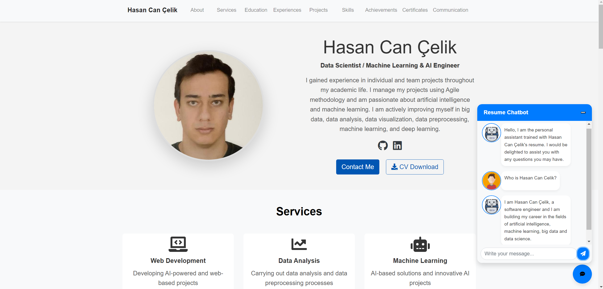

# Personal Portfolio and AI Chatbot Website



## 📜 Project Overview

Welcome to my personal portfolio website, developed using the Django web framework. This website serves as a comprehensive showcase of my professional background, skills, and projects. It features a user-friendly interface with various sections, including About, Services, Education, Experiences, Projects, Skills, Achievements, Certificates, and Communication.

One of the standout features of this site is the integration of an AI-powered chatbot. This chatbot is trained using neural networks on data extracted from my resume, allowing users to interact with it directly from the homepage. The chatbot can provide information about my background, skills, and experience, creating a dynamic and interactive user experience.

## ✨ Features

- **Responsive Design**: The website is fully responsive, ensuring an optimal viewing experience on devices of all sizes.
- **Dynamic Content Management**: All sections (About, Education, Experiences, etc.) are dynamically managed via Django’s backend, allowing for easy updates.
- **AI Chatbot Integration**: A custom-built chatbot, trained using neural networks on my professional data, allows users to interact and retrieve information about me.
- **Admin Panel**: Utilizes Django’s powerful admin panel for content management, making it easy to add, update, or remove content.
- **Clean and Modern UI**: Designed with Bootstrap and JavaScript, the website offers a sleek and professional look.

## 🛠️ Tech Stack

- **Frontend**: 
  - HTML5
  - CSS3
  - Bootstrap 5
  - JavaScript
- **Backend**:
  - Django 4.x
- **AI/ML**:
  - Python
  - Neural Networks (for chatbot)
- **Database**:
  - SQLite (default Django database, can be configured to use other databases like PostgreSQL or MySQL)
- **Deployment**:
  - To be specified (e.g., Heroku, AWS, DigitalOcean)

## 🚀 Getting Started

### Prerequisites

Before you begin, ensure you have the following installed on your system:

- Python 3.x
- Django 4.x
- Virtualenv (optional but recommended)

### Installation

Follow these steps to set up and run the project on your local machine:

1. **Clone the Repository**:
   ```bash
   git clone https://github.com/your_username/your_project.git
   cd your_project
